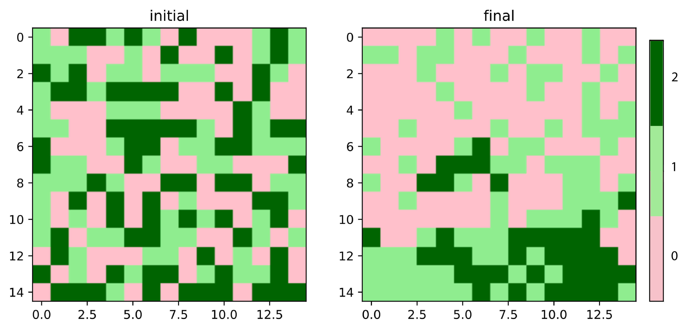
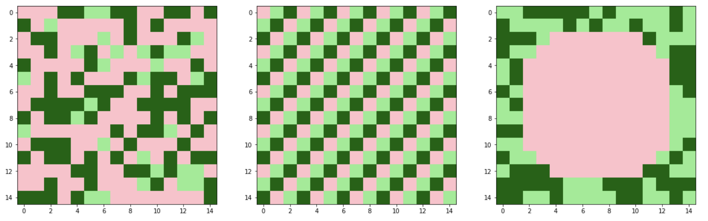
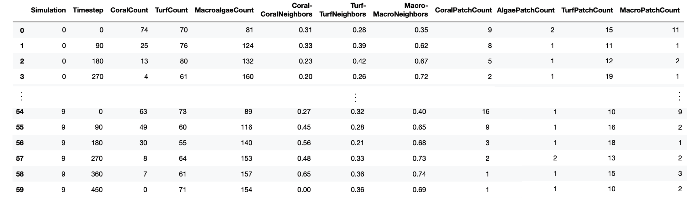

# coralModel

## Authors:

Rosanna Neuhausler and Maria Bruna

## Acknowledgement

This material is based upon work supported by the National Science Foundation under Grant No. DGE-1450053

----
----
For the purpose of drawing attention to specific parts of the python code throughout this introduction, I substitute non-focused on parts of the code with:
```python
     .
     .
```
---- 
             
## Model Overview

coralModel is a stochastic spatiotemporal model representing the spatiotemporal evolution of three competing coral reef benthic coverages:

* Coral
* Algal turf
* Macroalgae

The model is agent-based, with each agent being assigned one of the benthic coverage types listed above. 
Over time, an agent's type updates stochastically through probabilities determined by:
1. Overall reef conditions defined through input parameters, and
2. The node's immediate neighbors' types.

Below is an example of an 15x15 node reef's composition initially and after 100 runs (updates) 
(0=Coral, 1=Turf, 2=Macroalgae):





## Model Structure

We derived the rules for our model's dynamics from Mumby et al. (2007)'s reef competition ODE's, shown below [1]:


From the equations above, we extract a set of 5 reactions that describe the probabilities of switching between the respective node types:


We are consistent with Mumby et al. in considering the parameters `r`, `d`, `a`, `g`, and `y`, to represent overall reef conditions, but deviate through our use of neighborhood composition and agent-based approach. In our reactions above, we calculate `M`, `T`, `C` as local fractional cover (based on neighborhood benthic compositions) instead of global (reef-wide). We implement this through the spatial explicitness of our model.

Our model is a product of object oriented programming; we abstract benthic coverages as instances of the class `Organism()` that become appended to an instance of the class `Reef()`. 

We define these classes in `coralModel.py` as follows:

```python
class Organism():  
    def __init__(self, ID, type, location):
        self.ID = ID
        self.type = type
        self.neighbors = np.zeros(3)
        self.location = location
        
class Reef():
    def __init__(self):
        self.nodes = []
        self.graph = {}
        self.updates = {}
        
    def append(self, node):
     .
     .
    def generateGraph(self, radius=1.5)
     .
     .
    def roll(self, r, d, a, g, y, dt):
     .
     .
```


As can be seen above, each `Organism` carries the knowledge of:

1. Its specific type: 0 for Coral, 1 for Turf, 2 for Macroalgae .
2. The neighborhood composition: an 3-dimensional vector, containing the number of each benthic type represented in the set of neighboring agents (indexed by the type value from 1.).
3. Location: a 2 dimensional coordinate location of that agent, used in defining neighboring agents.


We define class `Reef()` to contain a graph listing each appended `Organism()`'s neighbors. This is first generated using our function `generateGraph()` once a `Reef()` is fully appended with `Organism()`s. Given the argument `radius`, `generateGraph()` calculates, for each agent (class `Organism()`), the neighboring agents within the given radius. This is stored in a dictionary and referenced by each `Organism()`'s `ID`.

The purpose of this is to be able to run the function `roll()`. With this function, we update `Organism()`'s type, for those appended in the `Reef()`, if a given probability of switching is met; an `Organism()`'s type is only updated when a random variable, generated at each timestep for each agent, falls within the range set by the respective agent's state (i.e. calculated from the terms shown on the arrows in our five reactions above).

This GitHub repository contains various python and shell scripts that allow for the user to create a reef and take it through a set number of iterations of `roll()`. The various potential initial reef setups and model dynamics are described next.   


## Model Setup

Model runs are initiated using shell scripts, found within `/scripts`. Within the most simple model setup, `coralModelExample.sh` you have the option to adjust the following parameters (comments not included in the file):

* The number of cores used for parallelization and the number of simulations:
```python
numberOfProcessors=4
numberOfSimulations=10
```
* The initial grid setup:
```python
coralPercent=33 ## percentage of initial nodes that are coral
algaePercent=33 ## percentage of initial nodes that are macroalgae
gridOption=0 ## initial profile options 0=random,1=checkered,2=with blob of one type in center
blobValue=0 ## only used is gridOption=2
``` 
The potential initial profiles from `gridOption` options are shown below:



* Grid size and radius of a nodes neighborhood:
```python
rows=15 
columns=15
radius=1.45
```
* Time settings:
```python
recordRate=90 #frequency of recording output data
dt=.1 
tf=50 #time final
```
* Model parameters:
```python
r=1.0
d=.4 
a=.2
g=.4
y=.75
```

## Model Run

Using the values set above, `coralModel.sh` calls `coralModel_functions.py`.

Within `coralModel_functions.py`, you will find `run_model()`, which creates the reef described in the .sh file and uses `roll()` to update the given reef for the set number of timesteps you set.

```python

def run_model(simulation):

    np.random.seed(simulation)

    Moorea = create_reef(simulation)
    Moorea.generate_graph(neighborhood_threshold)

    for timestep in range(0, number_of_timesteps):
        if timestep == 0:
            table = pd.DataFrame([])
        if timestep % record_rate == 0:
            table = pd.concat([table, pull_info(Moorea, simulation, timestep)])

        Moorea.roll(r=r, d=d, a=a, g=g, y=y, dt=dt)

    return(table)
```

As mentioned, `roll()` updates each agent based on a probability determined by neighboring benthic types, i.e. local fractional cover of species, and overall reef conditions, and a randomly generated number. If the randomly generated number falls within the bounds of the calculated probability, the agent switches to a different type. 

The inclusion of the local fractional cover can be seen in the code below, showing how the function `roll()` multiplies each reaction parameter with the density of specific types in the node's neighborhood in calculating the probability of type switching.

```python

    def roll(self, r, d, a, g, y, dt):

        for i, val in enumerate(self.nodes):
            U = np.random.uniform(0,1)
            total_neighborhood_count = self.nodes[i].neighbors.sum()
            coral_density = self.nodes[i].neighbors[0]/total_neighborhood_count
            turf_density = self.nodes[i].neighbors[1]/total_neighborhood_count
            algae_density = self.nodes[i].neighbors[2]/total_neighborhood_count

            if self.nodes[i].type == 0:

                if U <  (d / (1+coral_density)) * dt:

                    self.nodes[i].type = 1
                    self.inform(initial = 0, final = 1, nodeID = i)

                elif U < (a * algae_density +
                          d / (1+coral_density)) * dt:

                    self.nodes[i].type = 2
                    self.inform(initial = 0, final = 2, nodeID = i)

            elif self.nodes[i].type == 1:

                if U < (r * coral_density) * dt:
    .
    .
```

## Outputs

The final outputs from a .sh run are the following metrics, shown in the example output below:


Coral-CoralNeighbors represents the average number of coral neighbors for a coral node (similarly holds for Turf-TurfNeighbors and Macro-MacroNeighbors).

These specific values are set to be output in the function `pullInfo()`, shown below, within `coralModelTest.py`: 

```python
def pull_info(Moorea, simulation, timestep, image_counter=image_counter):

    image = np.array([Moorea.nodes[n].type
                      for n,val in enumerate(Moorea.nodes)])
    coral_count = np.count_nonzero(image==0)
    coral_neighbors = tl.extract_neighbors(Moorea, int(0), coral_count)
    turf_count = np.count_nonzero(image==1)
    turf_neighbors = tl.extract_neighbors(Moorea, int(1), turf_count)
    macroalgae_count = np.count_nonzero(image==2)
    macroalgae_neighbors = tl.extract_neighbors(Moorea, int(2), macroalgae_count)
    coral_patch_count, algae_patch_count, turf_patch_count, macroalgae_patch_count = tl.patch_counts(image, number_of_rows)
    data = [simulation, timestep, coral_count, turf_count, macroalgae_count,
            coral_neighbors, turf_neighbors, macroalgae_neighbors,
            coral_patch_count, algae_patch_count, turf_patch_count, macroalgae_patch_count, image]
    dataframe = pd.DataFrame([data])
  
    return(dataframe)
```


When run, `coralModel.sh` creates a folder network to organized model outputs based on the inputs. An example of this is shown below:
`output/15x15/grid0/grazing30/coral33-macro33-r10-d40-a20-y75-time5010-rec500-nsim100.csv`

(i.e. output, rows x columns, initial grid option, grazing value (x100 to remove decimals), 
coral percent, macroalgae percent, inputs r, d, a, y, final time, record rate, and number of simulations)


You can then visualize the output data using `modelOutputViewer.ipynb`. 


## Running coralModelTest.py and Exploring Outputs

To run the `coralModel_functions.py`, follow the following instructions:

1. Make sure you have python 3.6 installed
2. Open your terminal and `cd` to the location where you wish to store this repository
e.g.
```
cd Documents/models
```
3. clone the repository and `cd` into the scripts file
```
git clone https://github.com/rneuhausler/coralModel
cd coralModel/scripts
```
4. Run the model
```
sh coralModel-grazingLoop.sh
```
Once the model is done running, you should see a folder titled `/output` in the `/scripts` folder. In here, you will find all the csv files (described above in Outputs and Metrics) organized into folders (mentioned above in Outputs). 

To explore your outputs:

1. Open jupyter notebook (or lab)
```
jupyter notebook 
```
2. Within jupyter, open `modelOutputViewer.ipynb`


Enjoy!

## References

[1] Mumby, P. J., Hastings, A., & Edwards, H. J. (2007). Thresholds and the resilience of Caribbean coral reefs. Nature, 450(7166), 98–101. https://doi.org/10.1038/nature06252


