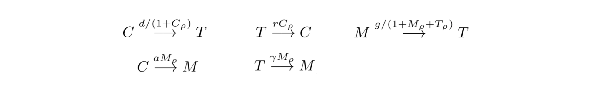

# coralModel

----
For the purpose of drawing attention to specific parts of the python code throughout this introduction, I substitute non-focused on parts of the code with:
```python
     .
     .
```
---- 
             
## Model Overview

coralModel is a stochastic spatiotemporal model representing the spatiotemporal evolution of three competing coral reef benthic coverages:

* Coral
* Algal turf
* Macroalgae

The model consists of various nodes, each of which is assigned one of these types of benthic coverage. 
Over time, a node's type updates stochastically through probabilities weighted by:
1. Overall reef conditions defined through input parameters, and
2. The node's immediate neighbors' types.

Below is an example of an 15x15 node reef's composition initially and after 100 runs (updates) 

(0=Coral, 1=Turf, 2=Macroalgae).:


### Model Structure

  We derived the rules for our model's dynamics from Mumby et al. (2007)'s reef competition ODE's, shown below [1]:


From the equations above, we extract a set of 5 reactions that describe the probabilities of a the different node types to switch:



We are consistent with Mumby et al. in considering the parameters `r`, `d`, `a`, `g`, and `y`, to represent overall reef conditions, but deviate through our use of neighborhood densities. In our reactions above, we represent `M`, `T`, `C` as local densities (based on neighborhood benthic compositions) instead of global percentages (reef-wide), which we are only able to do given the spatial explicitness of our model.


Our model is a product of object oriented programming; we abstract benthic coverages as instances of the class `Organism() `, and appending them to an instance of the class `Reef()`. 

We define these classes in `coralModel.py` as follows:

```python
class Organism():  
    def __init__(self, ID, type, location):
        self.ID = ID
        self.type = type
        self.density = np.zeros(3)
        self.location = location
        
class Reef():
    def __init__(self):
        self.nodes = []
        self.graph = {}
        self.updates = {}
        
    def append(self, node):
     .
     .
    def generateGraph(self, threshold=1.5)
     .
     .
    def roll(self, r, d, a, g, y, dt):
     .
     .
```


As can be seen above, each `Organism` has a specific type, density (


#### Model Setup


To create a reef model, the user establishes multiple instances of class `Organism()` with a benthic type (0=coral, 1=turf, 2=macroalgae), a coordinate location, and an ID number. These instances can then be appended to an instance of class `Reef()` as a node attribute, using `append()`. Once all the nodes are appended, the user can run `generateGraph()` to establish which instances of class `Organism()` are considered as neighbors of oneanother (based on a given distance threshold and the previously defined coordinate location). 

An example of this process, the creation of an 10x10 reef with randomly assigned types for the initial nodes, is shown below:

```python
    .
    .
for s in range(0,NumberOfSimulations):
    Moorea = Reef()                                                              # <-- Reef()
    count = 0
    for i in range(0,length):
        for j in range(0, width):
            U = np.random.choice([0,1,2],
                                 p=[coralPercent, turfPercent, algaePercent])
            node = Organism(type=U, location=[i,j], ID=count)                    # <-- Organism()
            Moorea.append(node)                                                  # <-- append()
            count = count + 1
    Moorea.generateGraph()                                                       # <-- generateGraph()
    .
    .    
    
```


#### Reef Update

Once the graph is generated, the user can run a timestep of the model, i.e. a stochastic update of node types, through `roll()`.


```python
def runModel(simulation):
        
    Moorea = createReef()
    Moorea.generateGraph(threshold) 
    
    for timestep in range(0,NumberOfTimesteps):
        if timestep == 0:
            table = pd.DataFrame([])
        if timestep % recordRate == 0:
            table = pd.concat([table, pullInfo(Moorea, simulation, timestep)])
            
        Moorea.roll(r=r, d=d, a=a, g=g, y=y, dt=dt)
        
    return(table)
    .
    .
```

`roll()` updates each node (i.e. instance of class `Organism()` within class `Reef()`) based a probability weighted by neighboring benthic coverages, determined by `generateGraph()`, and overall reef conditions, and a randomly generated number. If the randomly generated number falls within the bounds of the weighted probability, the node switches to a different type. 
These reactions emphasize the influence the parameters, pulled from the mumby equations, and species density around each node have on changing a spot on the reef from being one type to the other (e.g. the first reaction describes a coral (node) becoming macroalgae at the growth rate of macroalgae over coral and density of the two species. Whereas the mumby et al. equations consider the *global* population of coral of the system, we focus on the *local* composition around each node with assumptions such that if there is a macroalgae right next to the coral, that coral is more likely to switch to macroalgae than if it were surrounded by only other coral. This neighborhood information is stored within each node as the attribute `density` from class `Organism()`. This value is initially measured with `generateGraph()` and then updated throughout the simulation with `inform()` and `update()`, which are not shown in this introduction but can be found in `coralModel.py`.

The inclusion of the local type density can be seen in the code below, showing how the function `roll()` multiplies each reaction parameter with the density of specific types in the node's neighborhood in calculating the probability of type switching.

```python

    def roll(self, r, d, a, g, y, dt):
        for i, val in enumerate(self.nodes):      
            U = random.uniform(0,1)
            totalDensity = self.nodes[i].density.sum()
            coralDensity = self.nodes[i].density[0]/totalDensity
            turfDensity = self.nodes[i].density[1]/totalDensity
            algaeDensity = self.nodes[i].density[2]/totalDensity
            
            if self.nodes[i].type == 0:   
                if U <  (d * (1+coralDensity)) * dt:                    # <-- reaction parameter * density
                    self.nodes[i].type = 1
                    self.inform(initial = 0, final = 1, nodeID = i)
                elif U < (a * (1+algaeDensity) * (1+turfDensity) + 
                          d * (1+coralDensity)) * dt:
                    self.nodes[i].type = 2
                    self.inform(initial = 0, final = 2, nodeID = i)

            elif self.nodes[i].type == 1:
                if U > 1 - (r * (1+coralDensity) * (1+turfDensity)) * dt:
                    self.nodes[i].type = 0
                    self.inform(initial = 1, final = 0, nodeID = i)
    .
    .
            elif self.nodes[i].type == 2:
    .
    .
```


### Outputs

We pull and save the following metrics, shown in the example output below:


(Coral-CoralNeighbors represents the average number of coral neighbors for a coral node (same holds for Turf-TurfNeighbors and Macro-MacroNeighbors).) 


Currently, `coralModel.sh` creates a folder network to organized model outputs based on the inputs, as seen below:

`output/15x15/grid0/grazing30/coral33-macro33-r10-d40-a20-y75-time5010-rec500-nsim100.csv`

(i.e. output, rows x columns, initial grid option, grazing value (x100 to remove decimals), 
coral percent, macroalgae percent, inputs r, d, a, y, final time, record rate, and number of simulations)

You can visualize the output data using `modelOutputViewer.ipynb`. 


### Running coralModelTest.py and Exploring Outputs

To run the `coralModelTest.py`, follow the following instructions:

1. Make sure you have python 3.6 installed
2. Open your terminal and `cd` to the location where you wish to store this repository
e.g.
```
cd Documents/models
```
3. clone the repository and `cd` into the scripts file
```
git clone https://github.com/rneuhausler/coralModel
cd coralModel/scripts
```
4. Run the model
```
sh coralModel-grazingLoop.sh
```

Once the model is done running, you should see a folder titled `output` in the `scripts` folder. In here, you will find all the csv files (described above in Outputs and Metrics) organized into folders (mentioned above in Outputs and Metrics). 

To explore your outputs:

1. Open jupyter notebook (or lab)
```
jupyter notebook 
```
2. Within jupyter, open `modelOutputViewer.ipynb`


### References

[1] Mumby, P. J., Hastings, A., & Edwards, H. J. (2007). Thresholds and the resilience of Caribbean coral reefs. Nature, 450(7166), 98–101. https://doi.org/10.1038/nature06252


