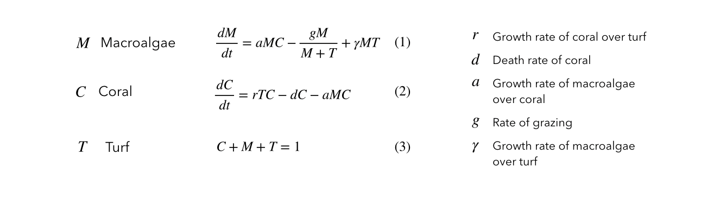

# coralModel*
*official name tbd

----
For the purpose of drawing attention to specific parts of the python code throughout this introduction, I substitute non-focused on parts of the code with:
```python
     .
     .
```
----              
## Overview

coralModel is a stochastic spatiotemporal model representing the spatiotemporal evolution of three competing coral reef benthic coverages:

* Coral
* Algal turf
* Macroalgae

The model consists of various nodes, each of which is assigned one of these types of benthic coverage. The node's type then updates stochastically through probabilities weighted by neighboring types and overall reef conditions defined through input parameters.

Below is an example of an 10x10 node reef's composition initially and after 100 runs (updates), as well as the total count of each type over time (0=Coral, 1=Turf, 2=Macroalgae).:


These plots were generated using `coralModelTest.py` and `coralModel.py`. Both of these files are found in this repository under "scripts". The first file is an example script of how to use the classes defined in the latter one to create your own reef model.


### Model Structure

Benthic coverages are abstracted as instances of the class `Organism() `, which are appended to the an instance of the class `Reef()`. Their attributed are defined in the `coralModel.py` as follows:

```python
class Organism():  
    def __init__(self, ID, type, location):
        self.ID = ID
        self.type = type
        self.density = np.zeros(3)
        self.location = location
        
class Reef():
    def __init__(self):
        self.nodes = []
        self.graph = {}
        self.updates = {}
        
    def append(self, node):
     .
     .
    def generateGraph(self, threshold=1.5)
     .
     .
    def roll(self, r, d, a, g, y, dt):
     .
     .
```

#### Creating the Reef

To create a reef model, the user establishes multiple instances of class `Organism()` with a benthic type (0=coral, 1=turf, 2=macroalgae), a coordinate location, and an ID number. These instances can then be appended to an instance of class `Reef()` as a node attribute, using `append()`. Once all the nodes are appended, the user can run `generateGraph()` to establish which instances of class `Organism()` are considered as neighbors of oneanother (based on a given distance threshold and the previously defined coordinate location). 

An example of this process, the creation of an 10x10 reef with randomly assigned types for the initial nodes, is shown below:

```python
    .
    .
for s in range(0,NumberOfSimulations):
    Moorea = Reef()                                                              # <-- Reef()
    count = 0
    for i in range(0,length):
        for j in range(0, width):
            U = np.random.choice([0,1,2],
                                 p=[coralPercent, turfPercent, algaePercent])
            node = Organism(type=U, location=[i,j], ID=count)                    # <-- Organism()
            Moorea.append(node)                                                  # <-- append()
            count = count + 1
    Moorea.generateGraph()                                                       # <-- generateGraph()
    .
    .    
    
```


#### Reef Update

Once the graph is generated, the user can run a timestep of the model, i.e. a stochastic update of node types, through `roll()`.

```
    for n in range(0,NumberOfRuns):
        for i,val in enumerate(Moorea.nodes):
            types[n,i,s] = Moorea.nodes[i].type
        coralCount[n,s] = np.count_nonzero(types[n,:,s] == 0)
        turfCount[n,s] = np.count_nonzero(types[n,:,s] == 1)
        algaeCount[n,s] = np.count_nonzero(types[n,:,s] == 2)
        Moorea.roll(r=r, d=d, a=a, g=g, y=y, dt=dt)                             # <-- roll()
    .
    .
```

`roll()` updates each node (i.e. instance of class `Organism()` within class `Reef()`) based a probability weighted by neighboring benthic coverages, determined by `generateGraph()`, and overall reef conditions, and a randomly generated number. If the randomly generated number falls within the bounds of the weighted probability, the node switches to a different type. The weighing is based on Mumby et al. (2014)'s reef competition ODE's, shown below:



From the equations above, we extract a set of 5 different reactions that are possible to occur:


These reactions emphasize the influence the parameters, pulled from the mumby equations, and species density around each node have on changing a spot on the reef from being one type to the other (e.g. the first reaction describes a coral (node) becoming macroalgae at the growth rate of macroalgae over coral and density of the two species. Whereas the mumby et al. equations consider the *global* population of coral of the system, we focus on the *local* composition around each node with assumptions such that if there is a macroalgae right next to the coral, that coral is more likely to switch to macroalgae than if it were surrounded by only other coral. This neighborhood information is stored within each node as the attribute `density` from class `Organism()`. This value is initially measured with `generateGraph()` and then updated throughout the simulation with `inform()` and `update()`, which are not shown in this introduction but can be found in `coralModel.py`.

The inclusion of the local type density can be seen in the code below, showing how the function `roll()` multiplies each reaction parameter with the density of specific types in the node's neighborhood in calculating the probability of type switching.

```python

    def roll(self, r, d, a, g, y, dt):
        for i, val in enumerate(self.nodes):      
            U = random.uniform(0,1)
            totalDensity = self.nodes[i].density.sum()
            coralDensity = self.nodes[i].density[0]/totalDensity
            turfDensity = self.nodes[i].density[1]/totalDensity
            algaeDensity = self.nodes[i].density[2]/totalDensity
            
            if self.nodes[i].type == 0:   
                if U <  (d * (1+coralDensity)) * dt:                    # <-- reaction parameter * density
                    self.nodes[i].type = 1
                    self.inform(initial = 0, final = 1, nodeID = i)
                elif U < (a * (1+algaeDensity) * (1+turfDensity) + 
                          d * (1+coralDensity)) * dt:
                    self.nodes[i].type = 2
                    self.inform(initial = 0, final = 2, nodeID = i)

            elif self.nodes[i].type == 1:
                if U > 1 - (r * (1+coralDensity) * (1+turfDensity)) * dt:
                    self.nodes[i].type = 0
                    self.inform(initial = 1, final = 0, nodeID = i)
    .
    .
            elif self.nodes[i].type == 2:
    .
    .
```


### Outputs

Currently, `coralModelTest.py` plots 

 1. The initial and final spatial configurations of the instance `Reef()`, side-by-side
 2. The timeseries of each type's count for the 100 runs
 3. The timeseries for 100 simulations averaged

However, within `coralModelTest.py`, the spatial distribution of the type at each timestep of a simulation is stored and can therefore also be saved and/or plotted. To save this file, uncomment line 61 (#np.savetxt("modelOutput.csv", types, delimiter=",")). This is currently commented out due to the large size of the file that it currently generates.

### Running coralModelTest.py

To run the `coralModelTest.py`, follow the following instructions:

1. Make sure you have python 3.6 installed
2. Open your terminal and `cd` to the location where you wish to store this repository
e.g.
```
cd Documents/models
```
3. clone the repository and `cd` into the scripts file
```
git clone https://github.com/rneuhausler/coralModel
cd coralModel/scripts
```
4. Run the model
```
python3.6 coralModelTest.py
```

It usually takes a few seconds to run. You will know it's complete when a figure showing the initial and final grid pop up.

You can also simply run this script using any of your favorite python IDEs.


